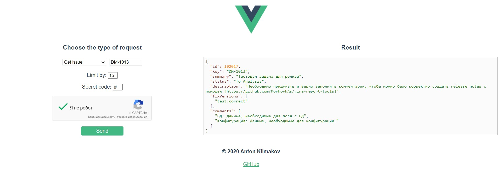

# Jira report tool service UI

It is a Vue.js client for getting Jira issues, getting reports on them, getting release notes.



## Installation
```
cd jira-report-tools/report-service-ui/
npm install
```

### Compiles and hot-reloads for development
```
npm run serve
```

### Compiles and minifies for production
```
npm run build
```

### Lints and fixes files
```
npm run lint
```

### Customize configuration
See [Configuration Reference](https://cli.vuejs.org/config/).

## Thanks!
Any questions or problems give me a shout on email avklimakov@gmail.com

## License
Copyright 2020 Anton Klimakov\
Licensed under the Apache License, Version 2.0